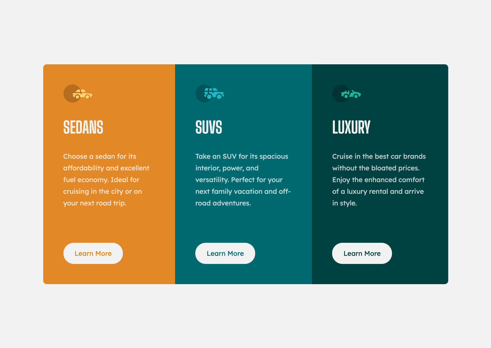
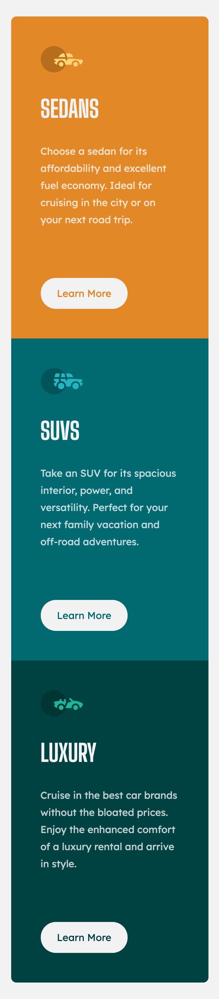

# Frontend Mentor - 3-column preview card component solution

This is a solution to the [3-column preview card component challenge on Frontend Mentor](https://www.frontendmentor.io/challenges/3column-preview-card-component-pH92eAR2-). Frontend Mentor challenges help you improve your coding skills by building realistic projects. 

## Table of contents

  - [The challenge](#the-challenge)
  - [Screenshot](#screenshot)
  - [Links](#links)
  - [Built with](#built-with)
  - [Style guide](#Style-guide)

### The challenge

Users should be able to:

- View the optimal layout depending on their device's screen size
- See hover states for interactive elements

### Screenshots

### Links

- Solution URL: [Add solution URL here](https://github.com/karisakib/frontend-mentor-3-col-card)
- Live Site URL: [Add live site URL here](https://dazzling-golick-d36aa7.netlify.app)

### Built with

- Semantic HTML5 markup
- CSS custom properties
- Flexbox

### Style guide

The designs were created to the following widths:

- Mobile: 375px
- Desktop: 1440px

Bright orange: hsl(31, 77%, 52%)
Dark cyan: hsl(184, 100%, 22%)
Very dark cyan: hsl(179, 100%, 13%)

Transparent white (paragraphs): hsla(0, 0%, 100%, 0.75)
Very light gray (background, headings, buttons): hsl(0, 0%, 95%)

- Font size: 15px

- Family: [Lexend Deca](https://fonts.google.com/specimen/Lexend+Deca)
- Weights: 400

- Family: [Big Shoulders Display](https://fonts.google.com/specimen/Big+Shoulders+Display)
- Weights: 700
